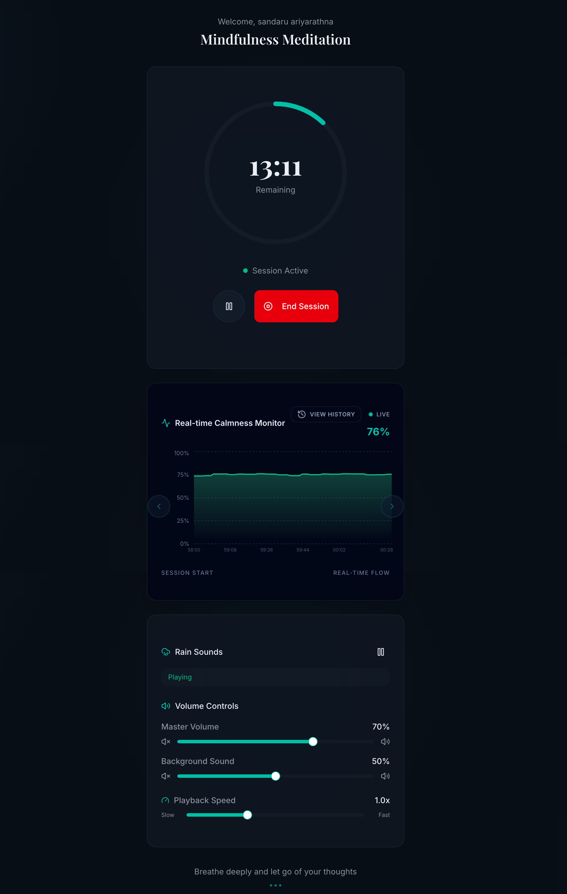
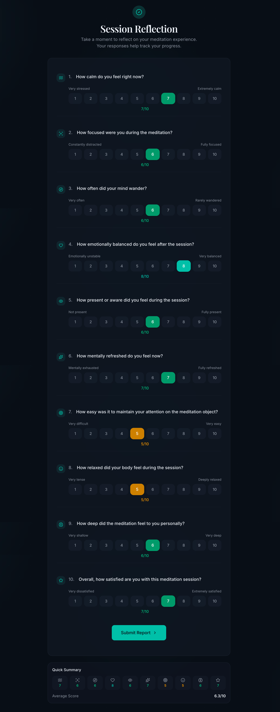
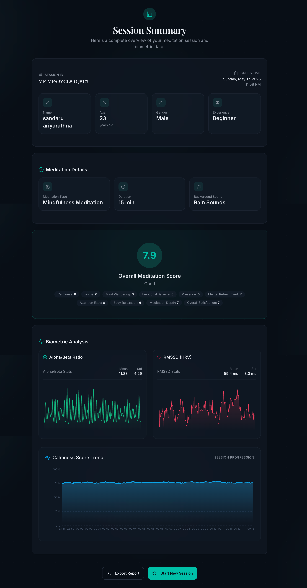
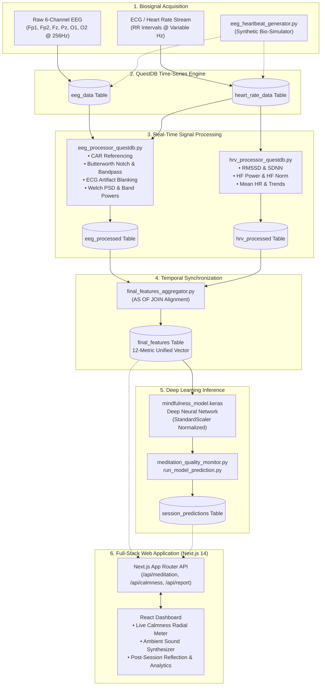

# MindFlow 🧘‍♂️⚡

> **Real-Time Multimodal Brain-Computer Interface (BCI) & Neurofeedback Meditation Platform**

[](https://frontend-eight-blush-74.vercel.app)
[](https://www.python.org/)
[](https://nextjs.org/)
[](https://www.typescriptlang.org/)
[](https://www.tensorflow.org/)
[](https://questdb.io/)
[](https://scipy.org/)
[](LICENSE)

> 🔗 **Live Cloud Deployment:** [https://frontend-eight-blush-74.vercel.app](https://frontend-eight-blush-74.vercel.app)

---

## 🌟 Overview

**MindFlow** is an end-to-end biofeedback and neuro-monitoring platform designed to capture, process, and evaluate meditation quality in real time. Combining **6-channel EEG (256 Hz)** with synchronized **Heart Rate Variability (HRV)** metrics, MindFlow translates continuous bio-signals into actionable psychological and physiological mindfulness insights.

The platform executes real-time digital signal processing (DSP), synchronizes asynchronous time-series streams in **QuestDB**, predicts deep meditation depth with a trained **Deep Neural Network ($R^2 = 0.916$)**, and visualizes live calmness through a responsive **Next.js** web application with ambient soundscape generation.

---

## 📸 System Showcase

<div align="center">

| Session Configuration | Active Neurofeedback Session |
| :---: | :---: |
|  |  |
| *Session setup: Duration, practice style, ambient soundscape selection* | *Real-time telemetry: Live calmness monitor, timer, audio controls* |

| Psychological Self-Reflection | Post-Session Biometric Analytics |
| :---: | :---: |
|  |  |
| *10-point subjective reflection capturing mental focus and presence* | *Deep ML score (7.9/10), Alpha/Beta ratio & HRV RMSSD trends* |

</div>

---

## 🏗️ System Architecture

MindFlow coordinates a multi-tier pipeline from raw biosignal acquisition to real-time full-stack visualization:



---

## ⚡ Key Features

### 1. Advanced Digital Signal Processing (DSP) Pipeline
- **Common Average Referencing (CAR)**: Dynamically eliminates electromagnetic interference and common-mode noise across all 6 electrode channels:
  $$\text{CAR}(x_i) = x_i - \frac{1}{N}\sum_{j=1}^{N} x_j$$
- **Zero-Phase Digital Filtering**:
  - **Notch Filter**: Attenuates 50/60 Hz mains powerline hum using a 2nd-order IIR notch.
  - **Bandpass Filter**: 4th-order Butterworth filter ($0.5 - 100\text{ Hz}$) isolating neurophysiologically relevant rhythms.
  - Executed via `scipy.signal.filtfilt` (forward-backward filtering) to preserve exact wave phase and latency.
- **Synchronized Heartbeat Artifact Removal**: Correlates ECG R-peak timestamps with EEG epochs, blanking or filtering $\pm 50\text{ ms}$ windows around cardiac spikes to prevent ballistocardiogram contamination.
- **Welch's Power Spectral Density (PSD)**: 5-second sliding windows with 50% overlap and Hanning windowing to extract exact spectral powers across the 5 canonical frequency bands.

| Wave Band | Frequency Range | Physiological Meaning |
| :--- | :--- | :--- |
| **Delta ($\delta$)** | $0.5 - 4\text{ Hz}$ | Deep sleep, restorative autonomic states |
| **Theta ($\theta$)** | $4 - 8\text{ Hz}$ | Deep meditation, creative visualization, subconscious access |
| **Alpha ($\alpha$)** | $8 - 12\text{ Hz}$ | Alert relaxation, tranquil awareness, mind-wandering reduction |
| **Beta ($\beta$)** | $12 - 30\text{ Hz}$ | Active cognitive processing, mental stress, analytical thought |
| **Gamma ($\gamma$)** | $30 - 100\text{ Hz}$ | High-level information binding, insight, cognitive synthesis |

- **Relaxation & Focus Ratios**: Real-time extraction of $\alpha/\beta$, $\theta/\alpha$, $\beta/\theta$, and $\theta/\beta$ indicators.

---

### 2. Autonomic Heart Rate Variability (HRV) Analysis
- **Time-Domain Metrics**:
  - **RMSSD**: Root Mean Square of Successive Differences between adjacent RR intervals (primary marker of parasympathetic vagal activity).
  - **SDNN**: Standard deviation of NN intervals (total autonomic variability).
  - **Mean Heart Rate & Trends**: Rolling derivative of autonomic acceleration/deceleration.
- **Frequency-Domain Metrics**:
  - **High-Frequency (HF) Power ($0.15 - 0.40\text{ Hz}$)**: Quantifies respiratory sinus arrhythmia (RSA) and parasympathetic brake activation.
  - **Normalized HF Power**: Proportional vagal influence relative to total power.

---

### 3. QuestDB Time-Series Synchronization
- High-throughput insertion via PostgreSQL wire protocol (`psycopg2`).
- Resolves the multi-rate biosignal synchronization challenge ($256\text{ Hz}$ continuous EEG vs. variable $0.8 - 1.5\text{ Hz}$ discrete RR intervals) using QuestDB's temporal **`AS OF JOIN`** feature:
  ```sql
  SELECT e.*, h.RMSSD, h.HF_Power, h.Heart_Rate_Mean
  FROM eeg_processed e
  AS OF JOIN hrv_processed h
  ON (e.timestamp = h.timestamp);
  ```
- Continuously populates the unified `final_features` feature store table partitioned by day.

---

### 4. Deep Learning Mindfulness Model
A feedforward deep neural network implemented in **TensorFlow/Keras** trained to predict continuous meditation quality scores ($0 - 10$) from a 12-dimensional physiological feature vector:

#### Input Feature Vector (12 Biometric Metrics)
```
[Alpha, Theta, Alpha/Beta Ratio, Theta/Alpha Ratio, RMSSD, HF Power, HF Norm, SDNN, Mean HR, Trend RMSSD, Trend SDNN, Beta/Theta Ratio]
```

#### Empirical Model Benchmarks
Evaluated on holdout validation data (`metrics.json`):

| Evaluation Metric | Score | Significance |
| :--- | :--- | :--- |
| **Coefficient of Determination ($R^2$)** | **0.9158 (91.6%)** | Exceptional variance explanation of meditation depth |
| **Root Mean Squared Error (RMSE)** | **0.8375** | Average error under $0.84$ on a 10-point scale |
| **Mean Absolute Error (MAE)** | **0.6544** | Tight median prediction error |
| **Mean Squared Error (MSE)** | **0.7014** | Low overall residual variance |

- Includes fitted standard feature scaling (`scaler_params.json`) and automated heuristic fallbacks for deployment resilience.

---

### 5. Reactive Next.js Web Dashboard
- **Frontend Stack**: Next.js 14 (App Router), React 19, TypeScript, Tailwind CSS, Lucide icons, Radix UI.
- **Adaptive Ambient Sound Generator**: High-fidelity sound engine with custom volumes and playback speeds for rain, ocean waves, crackling fire, forest ambience, waterfall, gentle piano, and pink/brown noise.
- **Live Calmness Monitor**: Real-time polling showing live session time, animated progress arc, and instantaneous biofeedback gauge.
- **Multi-Factor Self-Report Questionnaire**: 10-dimension post-session psychological assessment (calmness, focus, mind-wandering, emotional balance, presence, mental refreshment, attention ease, physical relaxation, depth, satisfaction).
- **Post-Session Analytics**: Comparative visualization contrasting subjective ratings with objective biometric metrics (Alpha/Beta ratios, RMSSD variance, and deep model predictions).

---

## 📂 Project Structure

```
MindFlow-v1.0/
├── final_features_aggregator.py    # Synchronizes EEG & HRV streams via QuestDB AS OF JOIN
├── eeg_processor_questdb.py        # Core DSP pipeline: CAR, Butterworth filtering, Welch PSD
├── hrv_processor_questdb.py        # Real-time HRV engine: RMSSD, SDNN, HF power calculation
├── eeg_heartbeat_generator.py      # Synthetic multi-channel EEG (256Hz) & ECG simulation engine
├── meditation_quality_monitor.py   # Real-time calmness streaming and state classifier
├── run_model_prediction.py         # End-of-session ML scoring and objective report generator
├── train_meditation_model.py       # Deep learning training script (TensorFlow / Keras)
│
├── mindfulness_model.keras         # Trained deep neural network model weights
├── scaler_params.json              # Standard scaler parameters (mean, scale, variance)
├── metrics.json                    # Model evaluation benchmarks (R² = 0.916, RMSE = 0.837)
│
├── utils/                          # Supporting utilities & testing modules
│   ├── config_and_testing.py       # Centralized config classes & data validation
│   ├── realtime_monitor.py         # Terminal-based continuous monitoring & alerts
│   ├── session_stats_calculator.py # Session-level statistical aggregations
│   └── quickstart_examples.py      # Standalone training & inference examples
│
├── frontend/                       # Next.js Full-Stack Web Application
│   ├── app/
│   │   ├── api/                    # API routes (/meditation, /calmness, /report, etc.)
│   │   ├── globals.css             # Application global styles
│   │   ├── layout.tsx              # Root application layout & theme provider
│   │   └── page.tsx                # Main single-page interactive meditation dashboard
│   ├── components/                 # React UI components (form, session, summary, sounds)
│   ├── lib/                        # QuestDB connection pool (`db.ts`) & utilities
│   ├── public/                     # Ambient sound files (.mp3) & platform icons
│   ├── package.json                # Frontend dependencies
│   └── tsconfig.json               # TypeScript configuration
│
├── MindFlowSS/                     # High-resolution platform UI screenshots
├── requirements.txt                # Python scientific, DSP, and ML dependencies
├── .gitignore                      # Git ignore rules for Python, Node, & system files
└── README.md                       # Complete platform documentation
```

---

## 🗄️ Database Schema (QuestDB)

MindFlow uses **QuestDB** (partitioned by day) to achieve sub-millisecond query performance on high-frequency biosignals:

| Table Name | Description | Key Fields |
| :--- | :--- | :--- |
| `eeg_data` | Raw 256 Hz multi-channel EEG | `timestamp`, `fp1`, `fp2`, `fz`, `pz`, `o1`, `o2` |
| `heart_rate_data` | Raw cardiac interval stream | `timestamp`, `rr_interval_ms`, `heart_rate_bpm` |
| `eeg_processed` | Filtered EEG spectral powers & ratios | `timestamp`, `session_id`, `alpha_power`, `beta_power`, `theta_power`, `alpha_beta_ratio`, `meditation_score` |
| `hrv_processed` | Computed heart rate variability | `timestamp`, `session_id`, `rmssd`, `sdnn`, `hf_power`, `heart_rate_mean` |
| `final_features` | Synchronized 12-feature vectors | `timestamp`, `session_id`, `Alpha`, `Theta`, `Alpha_Beta_Ratio`, `RMSSD`, `HF_Power`, `SDNN`, etc. |
| `calmness` | Real-time session telemetry score | `timestamp`, `session_id`, `calmness_score`, `state` |
| `self_reports` | Post-session subjective responses | `timestamp`, `sessionId`, `qualityScore`, `calmness`, `focus`, `mindWandering`, `bodyRelaxation`, etc. |
| `meditation_summaries` | Session aggregate statistics | `timestamp`, `sessionId`, `alphaBetaMean`, `alphaBetaStd`, `rmssdMean`, `rmssdStd`, `qualityScore` |
| `session_predictions`| ML model inference output | `timestamp`, `session_id`, `predicted_score`, `reported_score`, `overall_score` |

---

## 🚀 Quick Start & Local Setup

### 1. Prerequisites
- **Python**: 3.10+
- **Node.js**: 18.x or 20.x
- **Docker**: For running QuestDB (or native binary)

---

### 2. Start QuestDB
Run the official QuestDB container exposed on the default PostgreSQL wire protocol port (`8812`) and Web Console port (`9000`):

```bash
docker run -d \
  -p 9000:9000 \
  -p 8812:8812 \
  --name questdb \
  questdb/questdb:latest
```

*QuestDB Web Console will be accessible at `http://localhost:9000`.*

---

### 3. Setup Python Backend Environment
From the repository root:

```bash
# Create and activate virtual environment
python3 -m venv .venv
source .venv/bin/activate  # On Windows: .venv\Scripts\activate

# Install dependencies
pip install -r requirements.txt
```

---

### 4. Setup Next.js Frontend
Navigate to the frontend directory:

```bash
cd frontend

# Install Node dependencies
npm install

# Start development server
npm run dev
```

*Open `http://localhost:3000` (or `http://localhost:3001`) in your browser to view the application.*

---

### 5. Running the Pipeline

#### Option A: Full-Stack Web Flow (Recommended)
1. Ensure QuestDB is running and `.venv` is created in the repository root.
2. Open the web interface at `http://localhost:3000`.
3. Configure your session parameters (name, style, duration, ambient audio).
4. Click **Start Meditation**. The Next.js API automatically spawns the Python generators, DSP processors, and aggregation background processes.
5. Review live telemetry in real time, fill out the post-session reflection, and inspect the ML-generated biometric summary!

#### Option B: Standalone Python Testing
To run a manual simulation and verify signal processing:

```bash
# 1. Generate synthetic EEG and HR data
python eeg_heartbeat_generator.py --duration 300 --state relaxed

# 2. Run real-time EEG processor
python eeg_processor_questdb.py --duration 300

# 3. Run real-time HRV processor
python hrv_processor_questdb.py --duration 300

# 4. Aggregate features into unified feature store
python final_features_aggregator.py --duration 300

# 5. Evaluate session with Deep Learning Model
python run_model_prediction.py --session-id test_session
```

---

## 🧪 Model Training & Retraining

To train or fine-tune the deep learning model with custom biosignal datasets:

```bash
python train_meditation_model.py \
  --data your_features_data.csv \
  --epochs 150 \
  --batch-size 16 \
  --output ./models
```

---

## 🛠️ Tech Stack & Engineering Highlights

| Layer | Technologies | Engineering Highlights |
| :--- | :--- | :--- |
| **Signal Processing (DSP)** | Python, SciPy, NumPy | Common Average Referencing (CAR), 4th-order Butterworth zero-phase filtering, Welch PSD, ECG artifact suppression |
| **Machine Learning** | TensorFlow, Keras, Scikit-learn | Multi-layer deep neural network, StandardScaler normalization, $R^2 = 0.916$ cross-validated regression |
| **Time-Series Storage** | QuestDB, PostgreSQL Protocol, Psycopg2 | Nanosecond-precision timestamping, partitioned tables, sub-second `AS OF JOIN` temporal stream merging |
| **Full-Stack Application** | Next.js 14, React 19, TypeScript | App Router architecture, server-side process orchestration, responsive Tailwind CSS styling, Radix UI components |
| **Audio Synthesis** | HTML5 Web Audio API, Lucide | Multi-channel ambient audio generator with dynamic speed and volume attenuation |

---

## 📄 License

This project is licensed under the [MIT License](LICENSE).
